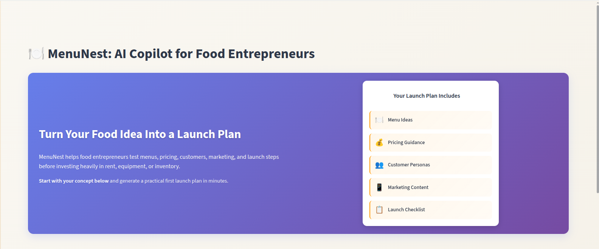

# MenuNest: AI Copilot for Food Entrepreneurs


MenuNest is an AI-powered web application that helps food entrepreneurs turn an early food business idea into a practical launch plan. It generates a market-ready menu, ingredient plan, pricing suggestions, customer personas, marketing content, and a launch checklist.

## Problem

Starting a food business is exciting, but many entrepreneurs struggle to move from a food idea to a practical launch plan. They may have recipes, culture, passion, and local demand, but they often lack support with menu planning, pricing, ingredient organization, marketing, and launch validation.

Without a clear plan, founders risk wasting money on the wrong menu, unclear pricing, poor positioning, or weak customer testing.

## Solution

MenuNest acts as an AI copilot for food entrepreneurs. From a simple food business idea, it generates a structured launch package that includes:

- Menu ideas
- Ingredient planning
- Pricing suggestions
- Customer personas
- Marketing content
- Launch checklist
- First-week validation plan

MenuNest helps founders move from:

> I have a food idea.

to:

> I have a menu, pricing plan, marketing content, and launch checklist.

## Target Users

MenuNest is designed for food entrepreneurs who want to launch or test a food business idea without hiring expensive consultants.

Initial users include:

- Cafe founders
- Coffee kiosk owners
- Catering businesses
- Food truck operators
- Home chefs
- Small restaurant founders
- Cultural and immigrant food entrepreneurs
- Local market vendors

The first demo focuses on food entrepreneurs in Italy and Europe, but the platform can later expand to larger restaurants, multi-location brands, food product companies, and startup incubators.

## Key Features

### 1. Business Idea Input

Users enter their food concept, business type, cuisine, location, budget, target customers, dietary focus, and launch goal.

### 2. AI Menu Generator

MenuNest generates 5 to 8 starter menu items with descriptions, categories, complexity levels, and suggested price ranges.

### 3. Ingredient and Allergen Plan

For each menu item, MenuNest suggests main ingredients, common allergens, preparation notes, and operational tips.

### 4. Pricing Suggestions

MenuNest provides approximate price ranges and pricing notes to help entrepreneurs start with realistic pricing assumptions.

### 5. Customer Personas

The app generates likely customer profiles, their needs, and recommended offers.

### 6. Marketing Content

MenuNest creates a slogan, Instagram bio, social media captions, and launch announcement.

### 7. Launch Checklist

The app generates practical steps for menu validation, marketing setup, operations, and first-week testing.

### 8. Exportable Report

Users can export the generated launch plan as Markdown or JSON.

## Example Use Case

Input:

```text
Business idea: I want to launch an Ethiopian coffee and breakfast kiosk.
Business type: Coffee kiosk
Cuisine: Ethiopian / East African
Location: Milan, Italy
Budget: 5,000-10,000 EUR
Target customers: Office workers, students, commuters
Launch goal: Start with a simple menu and test customer interest
```

## Vapi / Voice Assistant Integration

This repository is compatible with Vapi-style Function Tools using a single webhook endpoint. The Vapi integration uses a centralized tool-calls webhook endpoint on the backend:

- POST /vapi/tool-calls

If you are wiring the assistant in Vapi, follow the steps in the "Vapi setup" section below.

### Vapi Test Examples (deterministic dates)

Use these future-looking examples when testing bookings/appointments with the Vapi webhook to ensure consistent results across reviewers:

- Valid appointment

```json
{
	"preferred_date": "2026-06-01",
	"preferred_time": "09:30",
	"service_name": "Carta d'identita",
	"full_name": "Mario Rossi",
	"contact": "+39 333 1234567"
}
```

- Invalid (Sunday)

```json
{
	"preferred_date": "2026-05-31",
	"preferred_time": "11:30",
	"service_name": "Carta d'identita",
	"full_name": "Mario Rossi",
	"contact": "+39 333 1234567"
}
```

- Duplicate appointment (repeat the valid appointment request above)

- Slot conflict (same service/date/time with a different contact)

### Implemented edge cases

This project implements and defends against a number of real-world edge cases:

- Invalid date/time format handling (returns helpful validation errors)
- Voice-style date normalization (e.g. 20260610, spaced digits) and normalization to YYYY-MM-DD
- Voice-style time normalization (e.g. 9.3 → 09:30) and HH:MM enforcement
- Office-hour validation (rejects requests outside allowed hours)
- Duplicate appointment prevention (same user + same slot)
- Slot conflict prevention (different user, same slot)
- Vapi tool-calls webhook compatibility (single endpoint: /vapi/tool-calls)
- SQLite persistence for appointments (simple durable store)

### Vapi setup (quick)

1. Create three Function Tools in Vapi with these tool names:
	 - search_municipal_services
	 - create_appointment
	 - check_appointment

2. For all three Function Tools, set the Server URL to the same webhook endpoint (your ngrok URL):

```
https://YOUR-NGROK-URL.ngrok-free.dev/vapi/tool-calls
```

3. Attach each tool to the assistant and set the transcriber language to Italian.

4. Add the Italian system prompt (see vapi/agent_config.json) to your assistant settings so the assistant behaves in Italian and follows the booking flow.

5. Publish the assistant and keep ngrok running while testing.

6. Manual API endpoints still exist for testing/debugging:

- POST /tools/search-municipal-services
- POST /tools/create-appointment
- POST /tools/check-appointment

These endpoints accept the same parameters as the Vapi tool payloads and are useful for manual curl or Swagger testing.


Output:

```text
Suggested menu:
- Ethiopian coffee
- Spiced tea
- Sambusa
- Ful breakfast bowl
- Injera breakfast wrap
- Lentil bowl

Pricing:
- Coffee: 2.00-2.80 EUR
- Sambusa: 2.50-3.50 EUR
- Breakfast combo: 5.50-7.50 EUR

Marketing:
Authentic East African breakfast for Milan mornings.

Launch checklist:
- Test 5 core menu items
- Calculate ingredient cost per item
- Prepare allergen notes
- Create Instagram page
- Validate pricing with early customers
```

## Tech Stack

- Python
- Streamlit
- Pydantic
- Pandas
- JSON
- Markdown export
- Optional LLM API integration
- IBM Bob for AI-assisted development workflow

## Architecture

```text
User
 |
 v
Streamlit UI
 |
 v
Prompt Builder
 |
 v
AI Generator
 |
 v
JSON Validator
 |
 v
Report Renderer
 |
 v
Markdown / JSON Export
```

## How IBM Bob Was Used

IBM Bob was used as a development partner during the hackathon. It supported:

- Product workflow design
- Project structure planning
- Streamlit prototype development
- Prompt and JSON schema design
- Debugging
- Test creation
- README and documentation preparation
- Repository organization

The exported IBM Bob development report should be included in the `bob_reports/` folder.


## Built with IBM Bob

MenuNest was built for the IBM Bob Hackathon using IBM Bob as the AI-powered development partner.

IBM Bob helped accelerate the full software development workflow, including:

- Turning the initial product idea into a clear MVP
- Designing the GitHub repository structure
- Creating the Streamlit application flow
- Building modular Python files for prompts, validation, rendering, and export
- Improving the UI layout and demo reliability
- Creating fallback demo data for stable judging
- Writing tests for prompt building, validation, export, and AI response parsing
- Preparing README documentation and submission notes

This project demonstrates how IBM Bob can support a developer across the full development cycle, from planning and implementation to debugging, testing, documentation, and final submission.


## Project Structure

```text
menunest-ai-copilot/
├── README.md
├── app.py
├── requirements.txt
├── .env.example
├── .gitignore
├── LICENSE
├── src/
│   ├── __init__.py
│   ├── config.py
│   ├── prompt_builder.py
│   ├── ai_generator.py
│   ├── validators.py
│   ├── report_renderer.py
│   ├── export_utils.py
│   └── sample_data.py
├── tests/
├── reports/
├── bob_reports/
├── screenshots/
├── presentation/
└── docs/
```

## How to Run Locally

Follow these robust steps to run MenuNest locally. The project ships a `.streamlit/config.toml` file (UI theme and toolbar settings) that Streamlit will automatically pick up.

Clone the repository:

```bash
git clone https://github.com/your-username/menunest-ai-copilot.git
cd menunest-ai-copilot
```

Create and activate a virtual environment (POSIX):

```bash
python -m venv venv
source venv/bin/activate
```

On Windows (PowerShell):

```powershell
venv\Scripts\Activate.ps1
```

Install dependencies:

```bash
pip install -r requirements.txt
```

Create your environment file (copy placeholders):

```bash
cp .env.example .env
# Edit .env to add any provider keys if you plan to use live AI providers
```

Run the app (recommended: use the venv python to run Streamlit so shebang issues are avoided):

```bash
python -m streamlit run app.py
```

By default Streamlit uses port 8501. If port 8501 is already in use, Streamlit will suggest another port (e.g. 8502). You can force a specific port:

```bash
python -m streamlit run app.py --server.port 8502
```

Notes:
- The app ships a `.streamlit/config.toml` file that sets theme and hides stack traces in demo mode. Streamlit will automatically use it.
- For the hackathon/demo, `LLM_PROVIDER=demo` is the default and requires no API keys. To test live AI providers, add keys to your `.env` and set `LLM_PROVIDER` accordingly (see README sections on AI Provider Configuration).


## AI Provider Configuration

MenuNest supports four AI provider modes:

### 1. Demo Mode (Default - Recommended for Testing)

No API keys required. Uses dynamic demo generation based on user inputs.

```bash
LLM_PROVIDER=demo
```

**Advantages:**
- No cost
- Instant responses
- 100% reliable
- Perfect for presentations and judging

### 2. IBM watsonx.ai

Use IBM watsonx.ai for live AI generation.

**Setup:**

1. Get credentials from [IBM Cloud](https://cloud.ibm.com/)
2. Create a watsonx.ai project
3. Get your API key from IBM Cloud IAM
4. Add to `.env`:

```bash
LLM_PROVIDER=watsonx
WATSONX_API_KEY=your_api_key_here
WATSONX_PROJECT_ID=your_project_id_here
WATSONX_URL=https://us-south.ml.cloud.ibm.com
WATSONX_MODEL_ID=ibm/granite-13b-instruct-v2
```

**Recommended Models:**
- `ibm/granite-13b-instruct-v2` (balanced)
- `meta-llama/llama-3-70b-instruct` (advanced)

### 3. OpenAI

Use OpenAI GPT models for live AI generation.

**Setup:**

1. Get API key from [OpenAI Platform](https://platform.openai.com/api-keys)
2. Add to `.env`:

```bash
LLM_PROVIDER=openai
OPENAI_API_KEY=your_api_key_here
OPENAI_MODEL=gpt-4-turbo-preview
```

**Recommended Models:**
- `gpt-4-turbo-preview` (best quality)
- `gpt-3.5-turbo` (faster, lower cost)

### 4. Anthropic Claude

Use Anthropic Claude models for live AI generation.

**Setup:**

1. Get API key from [Anthropic Console](https://console.anthropic.com/)
2. Add to `.env`:

```bash
LLM_PROVIDER=anthropic
ANTHROPIC_API_KEY=your_api_key_here
ANTHROPIC_MODEL=claude-3-opus-20240229
```

**Recommended Models:**
- `claude-3-opus-20240229` (best quality)
- `claude-3-sonnet-20240229` (balanced)

### Error Handling

All AI providers automatically fall back to demo mode if:
- API keys are missing
- API calls fail
- Network errors occur
- Invalid responses are received

The app **never crashes** - it always provides a working launch plan.

### Security

- All API keys from environment variables only
- No keys in code or version control
- Keys never logged or exposed in output
- Keys redacted from error messages

**Important:** Never commit your `.env` file. Only commit `.env.example` with placeholders.

## Deployment

The MVP can be deployed on Streamlit Community Cloud.

Recommended deployment steps:

1. Push the repository to GitHub.
2. Go to Streamlit Community Cloud.
3. Connect your GitHub repository.
4. Select `app.py` as the entry file.
5. Add environment variables if using an AI API.
6. Deploy and copy the public app URL.

## Screenshots

Add screenshots after running the app:

```markdown



```

## Business Value

MenuNest helps food entrepreneurs validate ideas before spending heavily on rent, equipment, ingredients, and marketing. It reduces early planning friction and gives founders a practical first version of their menu, pricing, positioning, and launch plan.

## Future Roadmap

- PDF report export
- Multi-language support for Italy and Europe
- Italy/EU food compliance checklist
- More accurate food cost calculator
- Supplier and ingredient database
- Competitor and location analysis
- Saved user projects
- Restaurant POS or inventory integration
- Team collaboration features
- SaaS subscription model

## Team

Built for the IBM Bob Hackathon.

Team members:

- Letebrhan Alemayoh Siyum
- Team member 2
- Team member 3
- Team member 4

## License

This project is released under the MIT License.
